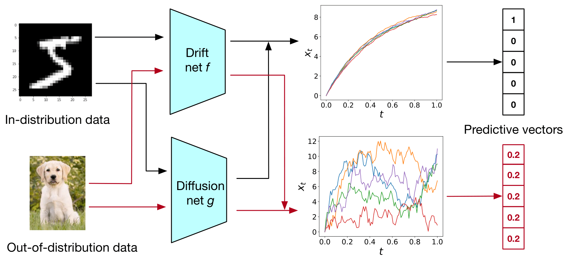

# SDE-Net
This repo contains our code for paper: 

Lingkai Kong, Jimeng Sun and Chao Zhang, SDE-Net: Equipping Deep Neural Network with Uncertainty Estimates, ICML2020.

[[paper](https://arxiv.org/abs/2008.10546)] [[video](https://www.youtube.com/watch?v=RylZA4Ioc3M)]




## Training & Evaluation

#### MNIST
```
cd MNIST
```
Training vanilla ResNet:
```
python resnet_mnist.py 
```
Evaluation:
```
python test_detection.py --pre_trained_net save_resnet_mnist/final_model --network resnet --dataset mnist --out_dataset svhn

```
Training MC-dropout:
```
python resnet_droput_mnist.py 
```
Evaluation:
```
python test_detection.py --pre_trained_net save_resnet_dropout_mnist/final_model --network mc_dropout --dataset mnist --out_dataset svhn

```
Training SDE-Net:
```
python sdenet_mnist.py 
```
Evaluation:
```
python test_detection.py --pre_trained_net save_sdenet_mnist/final_model --network sdenet --dataset mnist --out_dataset svhn
```

#### SVHN
```
cd SVHN
```
Training vanilla ResNet:
```
python resnet_svhn.py 
```
Evaluation:
```
python test_detection.py --pre_trained_net save_resnet_svhn/final_model --network resnet --dataset svhn --out_dataset cifar10
```
Training MC-dropout:
```
python resnet_droput_svhn.py 
```
Evaluation:
```
python test_detection.py --pre_trained_net save_resnet_dropout_svhn/final_model --network mc_dropout --dataset svhn --out_dataset cifar10
```
Training SDE-Net:
```
python sdenet_mnist.py 
```
Evaluation:
```
python test_detection.py --pre_trained_net save_sdenet_svhn/final_model --network sdenet --dataset svhn --out_dataset cifar10
```

#### YearMSD
```
cd YearMSD
```
Download and unzip the dataset from https://archive.ics.uci.edu/ml/machine-learning-databases/00203/

Training MC-dropout:
```
python DNN_mc.py
```
Evaluation:
```
python test_detection_mc.py --pre_trained_net save_mc_msd/final_model
```
Training SDE-Net:
```
python SDE_regression.py
```
Evaluation:
```
python test_detection_sde.py --pre_trained_net save_sdenet_msd/final_model
```

#### TODO: Active Learning


## Citation
Please cite the following paper if you find this repo helpful. Thanks!
```
@inproceedings{kong2020sde,
  title={SDE-Net: Equipping Deep Neural Networks with Uncertainty Estimates},
  author={Kong, Lingkai and Sun, Jimeng and Zhang, Chao},
  booktitle={International Conference on Machine Learning},
  year={2020}
}
```

